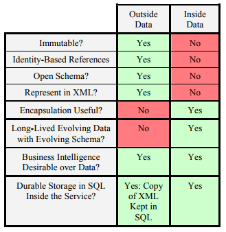
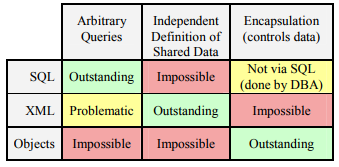

* Link: [cidrdb.org/cidr2005/papers/P12.pdf](cidrdb.org/cidr2005/papers/P12.pdf)
* Author: Pat Helland
* Year: 2005

The relevance of this paper today is as it was in 2005.
It is fascinating how technologies have changed these 12 years
and if we just change terms like XML to JSON, SOA to Micro-Services
or Relational Database to NoSQL Data Stores, the concepts will be
still accurate.

Pat Helland explains the dichotomy (as Ben Stopford called in his [post](https://www.confluent.io/blog/data-dichotomy-rethinking-the-way-we-treat-data-and-services/))
between data behind a Service boundary and data on the outside when
you follow a service-oriented architecture.

He highlight key challenges that will be need to be embraced if
the decision to follow this path is taken, like:

> "[In SOA] atomic transactions with two-phase commit **do not occur** accross multiple services."

and

> "Data owned by a service is, in general, **never allowed out of it** unless it is
> processed by application logic"

But this is just the beginning. Here is one quote I found amazing:

> **"Going to SOA is like going from Newton's physics to Einstein's physics**
>
> Newton's time marched forward uniformly with instant knowledge at a distance.
>
> Before SOA, distributed computing strove to make many systems look like one with RPC, 2PC, etc.
>
> In Einstein's universe, everything is relative to one's perspective.
>
> SOA has "now" inside and the "past" arriving in messages"

Everyone that is thinking to break a monolith system into a bunch of services
shall read this and ensure that the benefits worth taking these challenges.

As Adrian Colyer call it in its review here: https://blog.acolyer.org/2016/09/13/data-on-the-outside-versus-data-on-the-inside/

> Perhaps we should rename the “extract microservice” refactoring operation to “change model of time and space” ;).

The service developer that is aware of this challenge will have present that
the application logic will have to reconcile the "now" inside a service and
the "then" arriving as messages.

> **The world is no longer flat!!** SOA is recognizing that there is more than
> one computer working together.

From this first part we can conclude 2 main issues that have to be embrace in a SOA:

* ACID transaction won't be part of your toolbox
* Reconcile "now" and "then" is part of the application logic

Then this paper describes Data on the Ouside and Data on the Inside characteristics.
On one side, data on the outside:

> Data on the outside must be immutable and/or versioned data

Time-stamping, versioning, and not reusing important identifier, Helland says, are
excellent techniques to keep you messages immutable.

Two concepts are stablished when talking about data:

* Operators: action information that is part of a message. (e.g. Order amount, items)
* Operands: reference data, that gives context to the Operators. (e.g. Dapartment information linked to an Order)

And about Reference Data, Helland says:

> Each piece of reference data has both a *version independent identifier* and
> multiple versions, each of which is labeled iwth a *version dependent identifier*.
> For each piece, there is exactly one publishing service.

This concept of Reference Data is one key concept that in my experience creates
the most difficult scenarios in a SOA. Sharing data is a key feature and implement it
correctly is usually difficult: how much data should be shared? how do we control the access
to sensitive data on the consumer sides? Which approach should be taken to implement this
funcionality, request/response, messaging, log-oriented?

Nowadays I would say that Apache Kafka is a good fit to express and propagate`Reference Data`.

On the other side, to work with Data on the Inside we should take some considerations:

* Transactionality is ensured inside a service.
* Incoming Data is usually kept stored as a binary copy for auditing and non-repudiation.

XML and SQL are discussed as a way to represent data. Where XML extensibility and SQL
relational capabilities are key depending on the context (i.e. inside or outside data).
XML is unbounded vs Relational bounded representations.

And finally compare the benefits and weakness of the 3 ways to represent data: XML, SQL and Objects:

Concluding:

> We simply need all three of these representations and we need to use them in a fashion that plays to their respective strenghts!